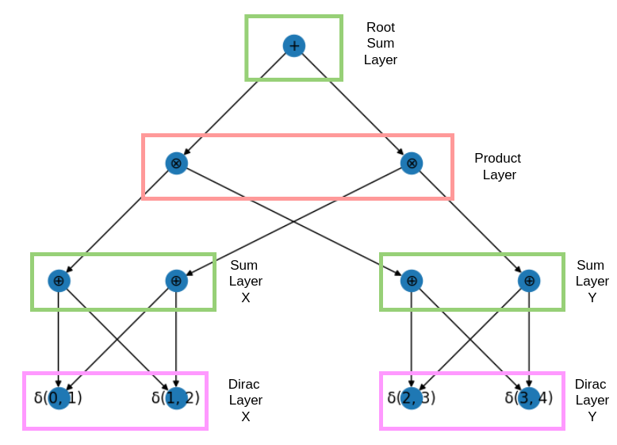

---
jupytext:
  cell_metadata_filter: -all
  formats: md:myst
  text_representation:
    extension: .md
    format_name: myst
    format_version: 0.13
    jupytext_version: 1.11.5
kernelspec:
  display_name: Python 3
  language: python
  name: python3
---

# Representations of Circuits

While understanding the concepts of a probabilistic circuit is subject to math, implementing it is a whole different
story.
This section discusses different approaches to represent circuits.

## the DAG (rustworkx) way

The easiest and naive way of implementing a circuit is using a directed acyclic graph (DAG).
The graph directly follows definition {prf:ref}`def-probabilistic-circuit`.

Let's look at an example.

```{code-cell} ipython3
import plotly
plotly.offline.init_notebook_mode()
from probabilistic_model.probabilistic_circuit.rx.probabilistic_circuit import *
from probabilistic_model.distributions import *
from random_events.variable import Continuous
import networkx as nx
from probabilistic_model.probabilistic_circuit.jax.probabilistic_circuit import ProbabilisticCircuit as JaxPC
import plotly.graph_objects as go
import matplotlib.pyplot as plt
import equinox as eqx


x = Continuous("x")
y = Continuous("y")
model = ProbabilisticCircuit()
sum1, sum2, sum3 = SumUnit(probabilistic_circuit=model), SumUnit(probabilistic_circuit=model), SumUnit(probabilistic_circuit=model)
sum4, sum5 = SumUnit(probabilistic_circuit=model), SumUnit(probabilistic_circuit=model)
prod1, prod2 = ProductUnit(probabilistic_circuit=model), ProductUnit(probabilistic_circuit=model)

sum1.add_subcircuit(prod1, np.log(0.5))
sum1.add_subcircuit(prod2, np.log(0.5))
prod1.add_subcircuit(sum2)
prod1.add_subcircuit(sum4)
prod2.add_subcircuit(sum3)
prod2.add_subcircuit(sum5)

d_x1 = leaf(UniformDistribution(x, SimpleInterval(0, 1)), probabilistic_circuit=model)
d_x2 = leaf(UniformDistribution(x, SimpleInterval(2, 3)), probabilistic_circuit=model)
d_y1 = leaf(UniformDistribution(y, SimpleInterval(0, 1)), probabilistic_circuit=model)
d_y2 = leaf(UniformDistribution(y, SimpleInterval(3, 4)), probabilistic_circuit=model)

sum2.add_subcircuit(d_x1, np.log(0.8))
sum2.add_subcircuit(d_x2, np.log(0.2))
sum3.add_subcircuit(d_x1, np.log(0.7))
sum3.add_subcircuit(d_x2, np.log(0.3))

sum4.add_subcircuit(d_y1, np.log(0.5))
sum4.add_subcircuit(d_y2, np.log(0.5))
sum5.add_subcircuit(d_y1, np.log(0.1))
sum5.add_subcircuit(d_y2, np.log(0.9))

model.plot_structure()
plt.show()
```

```{code-cell} ipython3
fig = go.Figure(model.plot(), model.plotly_layout())
fig.show()
```

The Benefits of the DAG representation are:
- Understandability
- Simplicity of implementation 
- Low installation overhead
- Great extendability
- Great for structure learning
- Great for teaching

The drawbacks are:
- Python implementations are usually slow
- Rustowrkx does not benefit from SMID instruction like jax would
- No benefit from modern hardware acceleration


## The Layered way
Modern literature suggests representing circuits in a way that is compatible with modern hardware 
acceleration. {cite}`liu2024scaling`, {cite}`peharz2020einsum`. 

Doing so requires a topological sorting of the circuit. In that topological sorting, each layer represents a set of 
nodes at the same depth (distance to the root) that can be computed in parallel.
These nodes have to be of the same type, such that their operations (weighted sum, product, density, etc.) can be computed in parallel.
The example from above would look as following:

```{code-cell} ipython3
jax_model = JaxPC.from_nx(model, progress_bar=False)
print(jax_model.root)
```

The way a layered pc is structured is shown in the figure below.



We can see that similar operations have been grouped together. 
Now they can be executed using a jax backend instead of a for loop in python. 
The Benefits of the layered representation are:
- Speed
- Compatible with modern frameworks for machine learning frameworks
- Compatible with modern hardware acceleration
- Most likely the future of probabilistic circuits


The drawbacks are:
- Harder to understand
- Harder to maintain
- Requires quite the overhead to install


## JAX Implementation

As of today, the layered approach is implemented in jax and supports all inferences that do not change the structure of
the circuit. 
These are all but marginalization and conditioning/truncation. 

The JAX implementation uses equinox to aid with an OOP approach to the circuit.
It uses sparse matrices to represent edges between the layers and hence does not suffer from extreme memory consumption
like EinsumNetworks.

JAX layered circuits are approximately **20** times faster than the rustworkx implementation in calculating the 
log-likelihood, and hence are a great tool for doing deep learning with circuits.
For the speed-up to kick in, the JAX computational graph that describes the circuit has to be compiled.
This is expensive, so don't do it more than needed.
However, for a fixed circuit, the speed-up is immense.

In the scripts folder, you can reproduce these results.

Be aware that the JAX implementation is still in development and might not be as stable as the networkx implementation.
I would be happy to get support here if someone is interested in it.

JAX and networkx formats can be converted into each other.